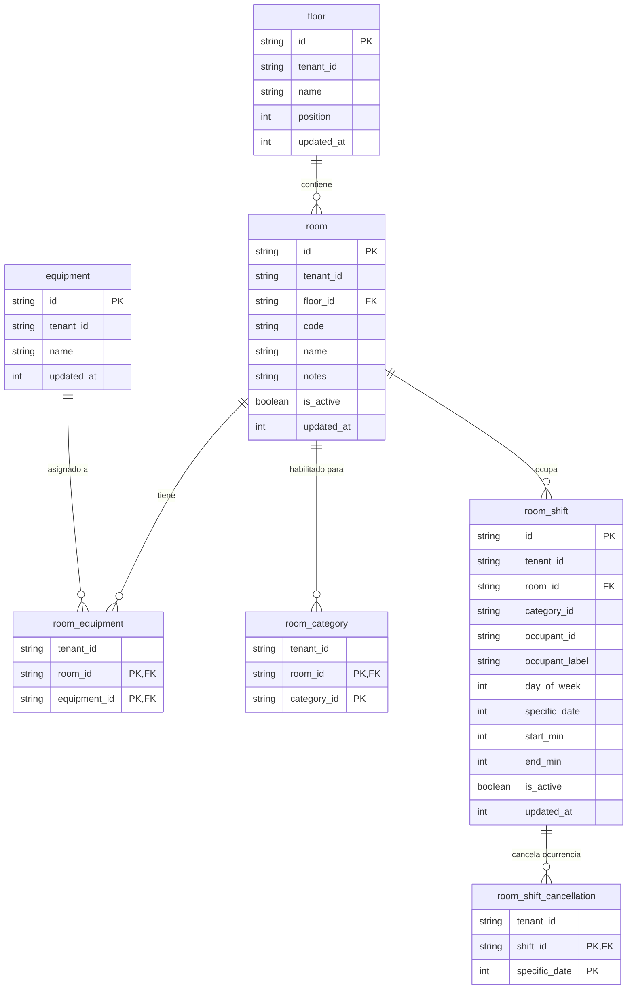

# Diagrama ERD - `room_layout`

```mermaid
erDiagram
    floor {
        string id PK
        string tenant_id
        string name
        int position
        int updated_at
    }

    room {
        string id PK
        string tenant_id
        string floor_id FK
        string code
        string name
        string notes
        boolean is_active
        int updated_at
    }

    equipment {
        string id PK
        string tenant_id
        string name
        int updated_at
    }

    room_equipment {
        string tenant_id
        string room_id PK, FK
        string equipment_id PK, FK
    }

    room_category {
        string tenant_id
        string room_id PK, FK
        string category_id PK
    }

    room_shift {
        string id PK
        string tenant_id
        string room_id FK
        string category_id
        string occupant_id
        string occupant_label
        int day_of_week
        int specific_date
        int start_min
        int end_min
        boolean is_active
        int updated_at
    }

    room_shift_cancellation {
        string tenant_id
        string shift_id PK, FK
        int specific_date PK
    }

    floor ||--o{ room : "contiene"
    room ||--o{ room_equipment : "tiene"
    equipment ||--o{ room_equipment : "asignado a"
    room ||--o{ room_category : "habilitado para"
    room ||--o{ room_shift : "ocupa"
    room_shift ||--o{ room_shift_cancellation : "cancela ocurrencia"
```
