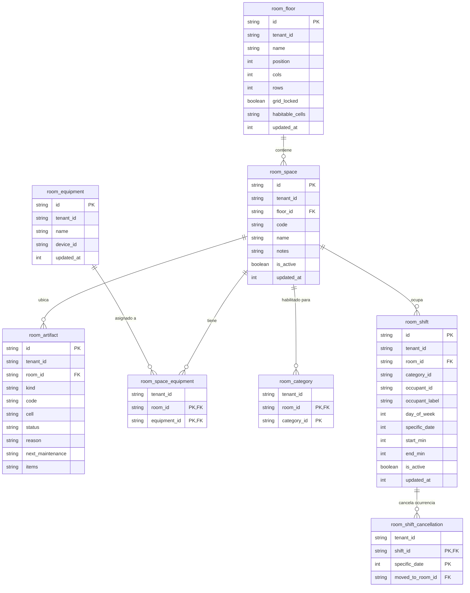

# Diagrama ERD - `room_layout`

```mermaid
erDiagram
    room_floor {
        string id PK
        string tenant_id
        string name
        int position
        int cols
        int rows
        boolean grid_locked
        string habitable_cells
        int updated_at
    }

    room_space {
        string id PK
        string tenant_id
        string floor_id FK
        string code
        string name
        string notes
        boolean is_active
        int updated_at
    }

    room_artifact {
        string id PK
        string tenant_id
        string room_id FK
        string kind
        string code
        string cell
        string status
        string reason
        string next_maintenance
        string items
    }

    room_equipment {
        string id PK
        string tenant_id
        string name
        string device_id
        int updated_at
    }

    room_space_equipment {
        string tenant_id
        string room_id PK, FK
        string equipment_id PK, FK
    }

    room_category {
        string tenant_id
        string room_id PK, FK
        string category_id PK
    }

    room_shift {
        string id PK
        string tenant_id
        string room_id FK
        string category_id
        string occupant_id
        string occupant_label
        int day_of_week
        int specific_date
        int start_min
        int end_min
        boolean is_active
        int updated_at
    }

    room_shift_cancellation {
        string tenant_id
        string shift_id PK, FK
        int specific_date PK
        string moved_to_room_id FK
    }

    room_floor ||--o{ room_space : "contiene"
    room_space ||--o{ room_artifact : "ubica"
    room_space ||--o{ room_space_equipment : "tiene"
    room_equipment ||--o{ room_space_equipment : "asignado a"
    room_space ||--o{ room_category : "habilitado para"
    room_space ||--o{ room_shift : "ocupa"
    room_shift ||--o{ room_shift_cancellation : "cancela ocurrencia"
```
